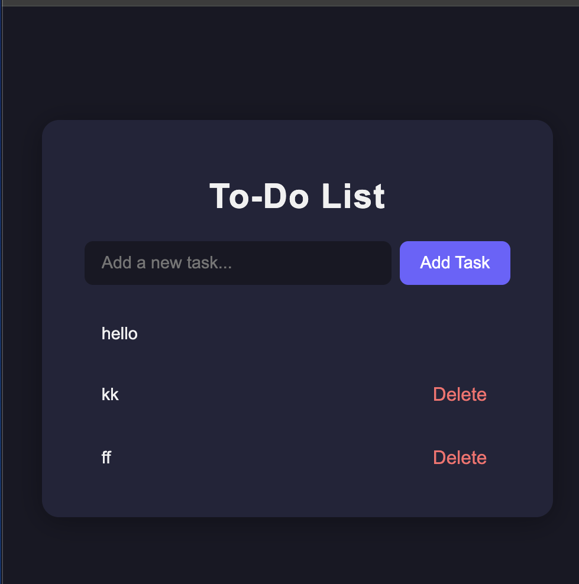

# To-Do List with Local Storage

A simple and stylish to-do list web app that saves your tasks in your browser's local storage. Add, view, and delete tasks with a modern UI.

## Features
- Add new tasks
- Delete tasks
- Tasks are saved in local storage (persist after refresh)
- Responsive and modern design

## Screenshot

## Usage
1. Open `index.html` in your browser.
2. Add a new task using the input field and "Add Task" button.
3. Delete tasks using the "Delete" button next to each item.

---

**Built with HTML, CSS, and JavaScript.**
