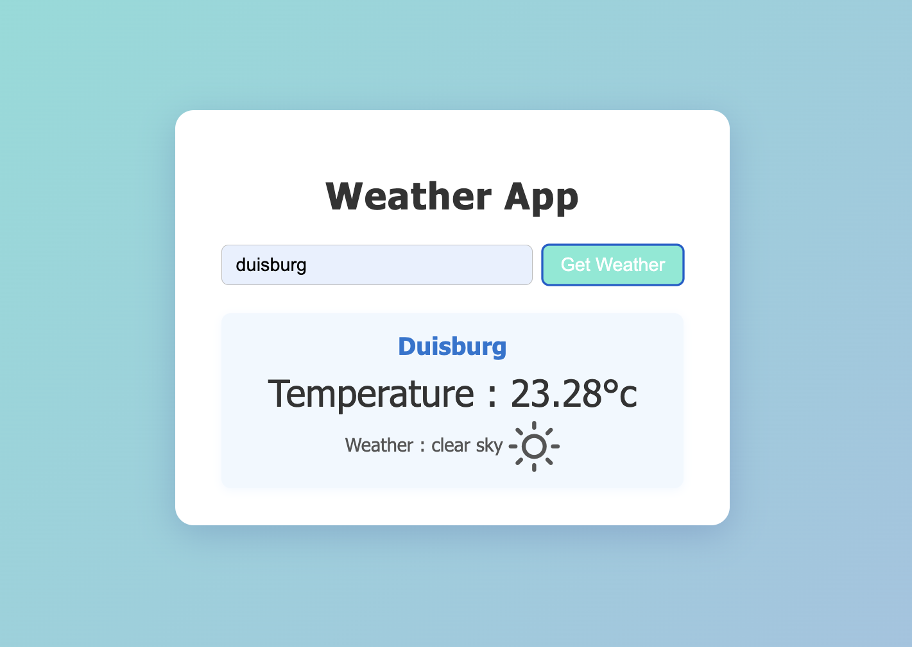

# Weather App

A simple and modern weather application that allows users to search for the current weather in any city using the OpenWeatherMap API.

## Features
- Search weather by city name
- Displays temperature, weather description, and an attractive weather icon
- Responsive and clean UI
- Error handling for invalid city names

## Demo Screenshot



## Getting Started

1. **Clone the repository**
2. **Install dependencies** (if any)
3. **Add your OpenWeatherMap API key**
   - Create a `config.js` file in the project folder:
     ```js
     var API_KEY = "YOUR_API_KEY_HERE";
     ```
   - Make sure `config.js` is included in your `.gitignore`.
4. **Open `index.html` in your browser**

## Usage
- Enter a city name and click "Get Weather" to view the current weather.

## Credits
- Weather data from [OpenWeatherMap](https://openweathermap.org/)
- Weather icons from [Weather Icons by Erik Flowers](https://erikflowers.github.io/weather-icons/)

---

*This project is for educational purposes.*
