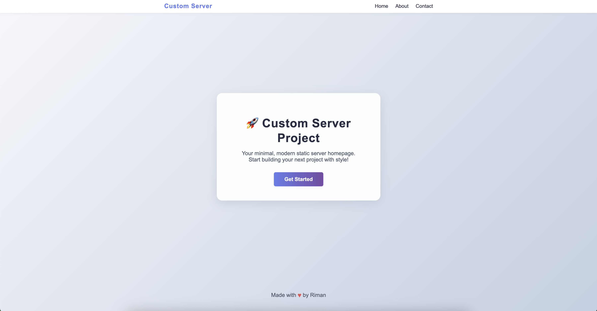
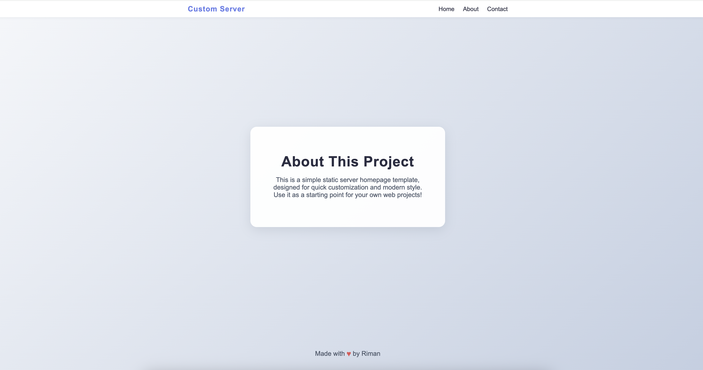
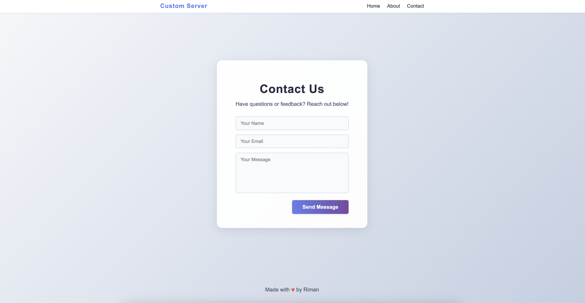

# Custom Server Project

A modern, minimal static server homepage template with About and Contact pages. Easily customizable for your own web projects.

## Features

-   Clean, responsive homepage with navigation
-   About and Contact pages
-   Stylish, modern CSS
-   Contact form (static)
-   Easy to extend and deploy

## Usage

1. Clone or copy this folder.
2. Serve the files using a static server or your own Node.js server (see `server.js`).
3. Open `index.html` in your browser.

## Screenshots

### Homepage

### About Page

### Contact Page

---

Feel free to customize the content and styles to fit your needs!
